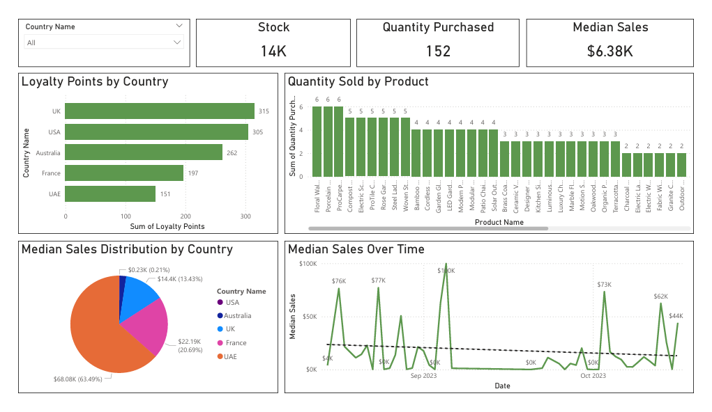
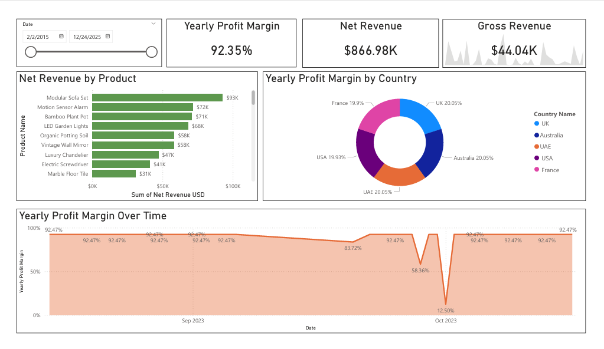

# 📊 Tailwind Traders Sales Analytics & Business Intelligence (Power BI)
### 🎓 Microsoft Power BI Data Analyst Specialization - Portfolio Project

---

## 📑 Table of Contents
- [Overview](#-overview)
- [Business Problem](#-business-problem)
- [Stakeholders](#-stakeholders)
- [Dataset Description](#-dataset-description)
- [Tools & Technologies Used](#-tools--technologies-used)
- [Skills Demonstrated](#-skills-demonstrated)
- [Key Metrics / KPIs](#-key-metrics--kpis)
- [Project Workflow](#-project-workflow)
- [Results](#-results)
- [Key Insights & Business Recommendations](#-key-insights--business-recommendations)
- [Challenges & Solutions](#-challenges--solutions)
- [Project Learnings](#-project-learnings)

---

## 📌 Overview
This project focuses on developing an interactive **Power BI Sales Analytics dashboard** for Tailwind Traders. The report provides insights into revenue performance, profit margins, customer loyalty trends, and product sales performance. The solution enables stakeholders to make data-driven business decisions by transforming raw transactional data into actionable insights.

---

## 💼 Business Problem
Tailwind Traders needs a centralized reporting solution to:

- Monitor sales performance across countries and products  
- Track revenue and profitability trends over time  
- Analyze customer loyalty program effectiveness  
- Identify high-performing and underperforming products  
- Support strategic decision-making through real-time insights  

---

## 👥 Stakeholders
- Executive Leadership Team  
- Sales Managers  
- Marketing Department  
- Finance & Business Analysts  
- Operations Team  

---

## 🗂 Dataset Description
The project utilizes multiple datasets representing sales transactions and supporting dimensions.

### 📁 Dataset Files
- **tailwind_traders_sales** → Core transactional sales dataset  
- **Countries** → Country-level geographic information  
- **Purchases** → Purchase and customer buying behavior data  

### 📊 Data Includes
- Sales transactions  
- Product and quantity information  
- Customer loyalty points  
- Country-level sales data  
- Purchase metrics  
- Date and time information  

---

## 🛠 Tools & Technologies Used
- Power BI Desktop  
- DAX  
- Power Query  
- Data Modeling  
- Data Visualization & Dashboard Design  

---

## 🚀 Skills Demonstrated
- Business Intelligence Reporting  
- Data Modeling & Star Schema Design  
- DAX Measure Development  
- KPI & Metric Development  
- Dashboard UX/UI Design  
- Performance Optimization using Performance Analyzer  
- Data Transformation using Power Query  
- Business Storytelling through Visual Analytics  

---

## 📏 Key Metrics / KPIs
- Yearly Profit Margin  
- Quarterly Profit Margin  
- Year-to-Date (YTD) Profit Margin  
- Median Sales  
- Quantity Sold  
- Customer Loyalty Points  
- Stock Levels  
- Quantity Purchased  

---

## 🔄 Project Workflow

1. **Understanding Business Requirements**
The project started by analyzing business reporting needs and identifying key KPIs required by stakeholders to track organizational performance.

---

2. **Data Collection & Import**
Datasets including sales transactions, purchases, and country data were imported into Power BI Desktop.

---

3. **Data Cleaning & Transformation (Power Query)**
Data preprocessing included:
- Validating data types  
- Handling missing or inconsistent values  
- Standardizing country and product naming  
- Preparing date fields for time intelligence analysis  

---

4. **Data Modeling**
A structured data model was created by:
- Building relationships between fact and dimension tables  
- Implementing calendar table for time-based analysis  
- Ensuring optimized model performance  

---

5. **DAX Measure Development**
Custom measures were developed to calculate:
- Profit margins across different time periods  
- Median sales values  
- Aggregated KPIs for executive reporting  

---

6. **Performance Optimization**
Performance Analyzer was used to:
- Monitor visual load times  
- Optimize DAX queries  
- Improve report responsiveness  

---

7. **Dashboard Development**
Two interactive dashboards were created:

- Sales Overview Dashboard  
- Revenue & Profit Performance Dashboard  

Each dashboard was designed with business-focused visual storytelling and interactive filtering capabilities.

---

## 📸 Results

| 1. Sales Overview Dashboard |
|-----------------------------|
|  |
| Provides a comprehensive view of product sales, loyalty points distribution, stock levels, and customer purchasing behavior. |

---

| 2. Revenue & Profit Performance Dashboard |
|-------------------------------------------|
|  |
| Highlights revenue trends, profit margin performance, and time-based sales insights supporting executive decision-making. |

---

## 💡 Key Insights & Business Recommendations

### 📊 Insights
- The UK shows the highest customer loyalty engagement.  
- Certain products demonstrate significantly higher sales volumes.  
- Profit margins remain consistent across analyzed time periods due to limited quarter data.  
- Median sales trends reveal seasonal purchasing behavior patterns.  

### ✅ Recommendations
- Increase marketing investment in high-loyalty regions.  
- Optimize inventory planning for high-demand products.  
- Expand loyalty programs to underperforming regions.  
- Track multi-quarter sales to identify long-term trends.  

---

## ⚠️ Challenges & Solutions

| Challenge | Solution |
|-----------|------------|
| Data inconsistencies across datasets | Applied transformation and validation using Power Query |
| Complex KPI calculations | Developed reusable and optimized DAX measures |
| Performance optimization | Used Performance Analyzer to improve visual loading times |
| Time-based analysis limitations | Created calendar table for accurate time intelligence |

---

## 📚 Project Learnings
- Improved expertise in business intelligence reporting using Power BI  
- Strengthened DAX and data modeling capabilities  
- Enhanced dashboard storytelling and stakeholder-focused visualization design  
- Learned performance optimization techniques for enterprise reporting solutions  
- Gained experience translating business requirements into technical analytics solutions  

---
